# Hi there, I'm Adyansh! 👋

### Robotics Engineer — Perception · Navigation · AI for Autonomous Mobile Robots

  
  
  
  
  

---

## 🚀 About Me

- 🤖 Robotics Engineer bridging **Perception / Computer Vision** with **Navigation / SLAM** for **Autonomous Mobile Robots (AMRs)**.
- 💼 Currently **Robotics Software Developer @ Robotics Collective** · previously **Addverb Technologies** & **Sakar Robotics**.
- 🎓 **M.Sc. Robotic Systems Engineering** @ **RWTH Aachen University** (BTech Mech, CGPA 9.4/10).
- ⚡ I love turning theoretical AI models into **robust, real-world hardware deployments** — and squeezing C++ perception pipelines with HPC (AVX-512, CUDA).
- 🌱 Interests: ROS2, SLAM, sensor fusion, VLA models, imitation learning, sim-to-real.
- 💬 Ask me about **ROS/ROS2, AMRs, perception, SLAM, and simulation**.
- 📫 Reach me: **gupta.adyansh@gmail.com**

---

## 🌟 Featured Projects

### 🤖 Robotics & Autonomy
- **[Go2 Autonomous Inspection](https://github.com/Adyansh04/go2-ros2-inspection)** — Natural-language-driven facility inspection on a **Unitree Go2** quadruped (ROS2 · RTAB-Map SLAM · Nav2 · YOLOE · MCP→Claude).
- **[OLIVE](https://github.com/Adyansh04/olive)** — Graph-based **multi-sensor fusion** backend (LiDAR, Inertial, Vision, Encoders) for drift-free AMR localization. *([sim](https://github.com/Adyansh04/olive_sim))*
- **[WhyCode](https://github.com/Adyansh04/whycode)** — High-performance **WhyCon/WhyCode fiducial detection** in C++ with **AVX-512 SIMD** — CPU 180% → 10-15%. *([bench](https://github.com/Adyansh04/whycode-bench) · [sim](https://github.com/Adyansh04/whycode-sim))*
- **[R2 — ABU Robocon 2024](https://github.com/Adyansh04/R2-Robocon)** — Autonomous 4-wheel **mecanum** robot (ROS2 · YOLO · Nav2 · Micro-ROS).
- **[AgroBot](https://github.com/Adyansh04/AgroBot)** — ROS2 **cotton-plucking** agricultural robot (Cartographer SLAM · YOLO · manipulator kinematics).
- **[OmniBot (Kiwi Drive)](https://github.com/Adyansh04/omnibot)** — Three-wheel **omnidirectional** robot (ROS2 · Micro-ROS · EKF · ESP32 · CNN).
- **[Vanguard — eYRC 2023-24](https://github.com/Adyansh04/eyrc23_gg_1306)** — Overhead-camera-guided **A\*** navigation robot (CNN · QGIS · ESP32).
- **[Drone Systems](https://github.com/Adyansh04/TelloEDU-ROS2)** — Autonomous drone nav & CV on **Tello EDU / Crazyflie** (ROS2 · Nav2 · SLAM Toolbox). *([SkyNet-ROS2](https://github.com/Adyansh04/SkyNet-ROS2))*
- **[R1 Demo](https://github.com/Adyansh04/r1-demo-rc)** — Teleoperation & control demo for the **Unitree R1** humanoid.

### 🧠 AI & Data
- **[Sepsis Atlas](https://github.com/Adyansh04/sepsis-atlas)** — Local-first **RAG** platform turning medical PDFs into source-grounded evidence tables (ChromaDB · Claude 3.5 · Pydantic).

### 🏆 Hackathons
- 🥇 **[Game AI Hackathon](https://github.com/Adyansh04/hex-game-hackathon)** — 1st place · autonomous **Hex** pathfinding agent.
- 🥈 **[Bonding × Itestra](https://github.com/Adyansh04/itestra-hackathon)** — 2nd place · autonomous multiplayer-Snake bots.

### 🧰 Dev Tools
- **[ros2-project-template](https://github.com/Adyansh04/ros2-project-template)** · **[ros-docker-dev](https://github.com/Adyansh04/ros-docker-dev)** — reusable ROS2 scaffolding & Docker dev environment.

> 🔎 Explore everything → **[github.com/Adyansh04?tab=repositories](https://github.com/Adyansh04?tab=repositories)**

---

## 🛠️ Technologies & Tools

**Robotics**

**Languages & HPC**

**AI & Vision**

**Tooling & CAD**

---

## 📊 GitHub Stats

---

## 🔗 Connect with Me

- 🌐 **Portfolio:** [adyansh04.github.io/my-portfolio](https://adyansh04.github.io/my-portfolio/)
- 💼 **LinkedIn:** [linkedin.com/in/adyanshgupta](https://www.linkedin.com/in/adyanshgupta/)
- 📧 **Email:** gupta.adyansh@gmail.com
