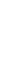

<!-- ══════════════ HEADER ══════════════ -->

  

  

  
  
  
  
  

---

## 🚀 About Me

- 🤖 Robotics Engineer focused on **Perception**, **Navigation** and **AI** for embodied systems.
- 🦿 I build autonomy for **humanoids**, **quadrupeds**, **AMRs** and **drones** — SLAM and multi-sensor fusion through to whole-body control.
- 🎓 **M.Sc. Robotic Systems Engineering** @ **RWTH Aachen University** · BTech Mechanical Engineering.
- ⚡ I turn models into **real-world hardware deployments** — C++ perception pipelines accelerated with **SIMD / SIMT and CUDA**.
- 🌱 Interests: ROS 2, SLAM, sensor fusion, VLA models, imitation learning, sim-to-real.
- 💬 Ask me about **ROS / ROS 2, perception, navigation, SLAM and simulation**.

---

## 🌐 Project Network

<table>
<tr>
<td align="center" valign="top">
   
   
   
   
   
   
   
   
  
</td>
<td></td>
<td align="center" valign="top">
   
   
   
   
   
   
   
  
</td>
</tr>
</table>

---

## 🛠️ Technologies & Tools

<b>ROBOTICS &amp; AUTONOMY</b>

  
  
  
  
  
  
  
  
  

<b>LANGUAGES &amp; ACCELERATION</b>

  
  
  
  
  
  

<b>PERCEPTION &amp; AI</b>

  
  
  
  
  
  

<b>TOOLING &amp; CAD</b>

  
  
  
  
  
  

---

## 📊 GitHub Stats

  

---

## 🦾 Contribution Graph

  <picture>
    <source media="(prefers-color-scheme: dark)" srcset="./assets/contrib-gantry-dark.svg">
    <source media="(prefers-color-scheme: light)" srcset="./assets/contrib-gantry-light.svg">
    
  </picture>

---

  

